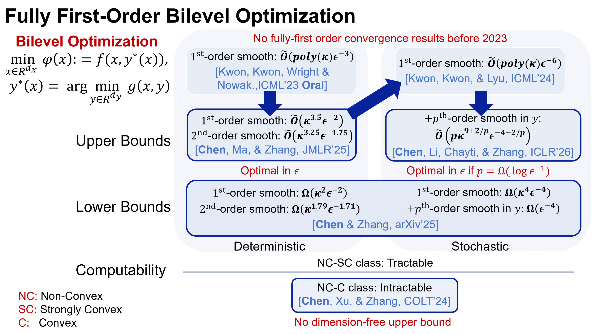

## Description

Official repository for "Near-Optimal Nonconvex-Strongly-Convex Bilevel Optimization with Fully First-Order Oracles" and a series of follow-up works. In these works, we give comprehensive studies on the computability of the problem, lower complexity bounds, and near-optimal deterministic / stochastic algorithms.

## News

* (2026/1) F2SA-p [3] for near-optimal stochastic highly smooth problems was accepted by ICLR 2026.

* (2025/11) We posted a paper [4] about lower bounds on arXiv.

* (2025/5) F2BA was accepted by JMLR 2025. We also changed our codebase to [ScaleBiO](https://github.com/2003pro/ScaleBiO) in JMLR revision.

* (2024/5) Our work on hardness results [2] was accepted by COLT 2024, and we also extended the analysis of F2BA to structured nonconvex-nonconvex (NC-NC) problems.

* (2023/6) We proved F2BA [1] is near-optimal for nonconvex-strongly-convex (NC-SC) problems and posted our result on arXiv.

## Reference 

* [1] **Lesi Chen**, Yaohua Ma, and Jingzhao Zhang, _Near-Optimal Nonconvex-Strongly-Convex Bilevel Optimization with Fully First-Order Oracles_ [[JMLR 2025]](https://arxiv.org/abs/2306.14853)
* [2] **Lesi Chen**, Jing Xu, and Jingzhao Zhang, _On Finding Small Hyper-Gradients in Bilevel Optimization: Hardness Results and Improved Analysis_ [[COLT 2024]](https://arxiv.org/abs/2301.00712)
* [3] **Lesi Chen**, Junru Li, El Mahdi Chayti, and Jingzhao Zhang, _Faster Gradient Methods for Highly-smooth Stochastic Bilevel Optimization_ [[ICLR 2026]](https://arxiv.org/abs/2509.02937)
* [4] **Lesi Chen** and Jingzhao Zhang. _On the Condition Number Dependency in Bilevel Optimization_ [[arXiv 2025]](https://arxiv.org/abs/2511.22331)
